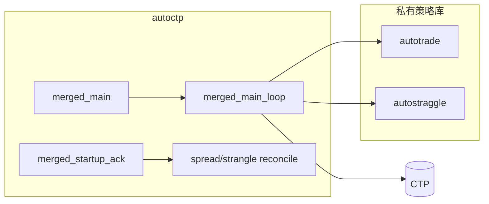

# AutoCTP 架构说明（公开脱敏版）

单进程、单 CTP 连接，调度 **价差 Call Spread**（autotrade）与 **宽跨 Long Strangle**（autostraggle）。策略实现位于私有库；本仓仅编排、对账、入账与 halt 路径。

## 组件关系

## 全局约束

| 项 | 说明 |
|----|------|
| 禁止双进程 | 勿与 `auto_main.py` / `straggle_main.py` 同账户并行 |
| 全局 1 在途 | 两策略共用，互不抢撤单 |
| OrderRef 分段 | 价差 `1…spread_order_ref_max`；宽跨 `≥ order_ref_min`（默认 500000） |
| 持仓认领 | `data/spread_positions.csv`（signed）、`data/strangle_positions.csv`（多头） |
| 飞书暂停 | **人工全停**（含平仓），非缺陷 |

## 三种 halt 与两条价差路径

| halt | 触发 | 价差路径 | 宽跨 |
|------|------|----------|------|
| **对账 halt** | CSV ≠ CTP | **close-only** | `open_halted` |
| **日限 halt** | `daily_trade_limit` 达限 | 完整 `process_symbol`，禁新开 | 日金额限新开 |
| **保证金 halt** | `global_margin_limit` 超限 | 完整 `process_symbol`，开仓/再平衡内检查 | `open_halted`（保证金） |

- 对账 halt 时账本不可信，禁止再平衡/开仓，仅尝试按认领平仓。
- 日限/保证金 halt 时账本可信，仍走 autotrade 完整平仓条件与冷却；**不是**紧急全平。

## spread_positions.csv 为空

空表表示本策略**不认领**任何价差腿，不能推断 CTP 无价差仓。外部/手工 Call 靠启动确认、derive 与对账 halt 处理。

## 主循环顺序

`dual_strategy.strategy_order` 默认 `[spread, strangle]`：每轮先扫价差品种，再扫宽跨。

## 对账与入账

- 周期：`dual_strategy.reconcile_interval_sec`（默认 60s）
- 宽跨可排除价差腿：`exclude_spread_from_strangle_reconcile`
- 价差成交写入 CSV：`spread_fill_sync` + OrderRef 分段过滤
- derive 后可有豁免窗口：`reconcile_grace_after_derive_sec`

## 运行时产物（勿提交 git）

| 路径 | 说明 |
|------|------|
| `data/*` | 持仓 CSV、账本、启动 ack、fill_ledger（保留 `*example*` 模板） |
| `futuretrade/` | autotrade 执行统计（如 `execution_stats/*.jsonl`），本仓编排不写此目录 |

`.gitignore` 与 `scripts/check_sensitive_files.py` 会拦截误跟踪；改 CSV/ledger 后运行 `python scripts/invalidate_startup_ack.py` 再冷启动（删 ack + .meta.json + external JSON）。

## 残余风险告警（可选）

`runtime_risk_alerts` 在飞书暂停、保证金查询 `unknown`、重连隔离、对账 halt 等场景发飞书，**不改变** halt/交易语义。见 `merged_config.example.yaml` 注释项。

## 文档索引

| 文档 | 说明 |
|------|------|
| [README.md](../README.md) | 快速启动 |
| [COMPAT.md](COMPAT.md) | 三仓版本与 CI |
| [CI.md](CI.md) | GitHub Actions |
| [PUBLIC_REPO.md](PUBLIC_REPO.md) | 公开边界 |
| 本地 `docs/LOCAL完整说明.md` | 完整运维（勿提交） |

策略细节见私有库文档；修改 halt 或主循环前请读 `.cursor/rules/dual-strategy-halt-semantics.mdc`。
